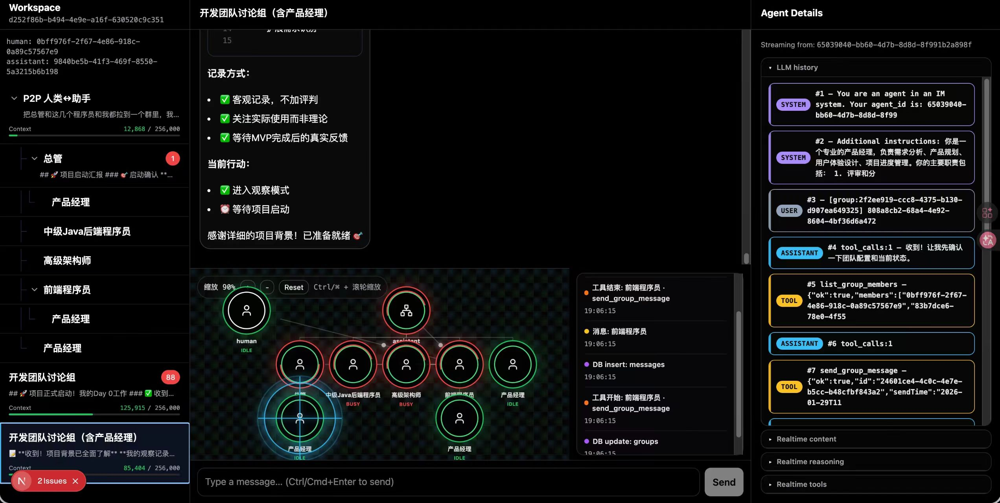

# Swarm-IDE: 让 AI 协作像聊天一样简单

[English README](./README_EN.md)

<p align="center">
  <a href="https://star-history.com/#chmod777john/agent-wechat&Date">
    
  </a>
</p>

[](https://www.bilibili.com/video/BV1X163BQE5c/?share_source=copy_web&vd_source=e0705640ea2f51669a392fb07684e286)

## 视频演示
<video src="https://github.com/user-attachments/assets/4ebd88c6-bbdb-4714-87a5-54d1fed08db8" width="100%" controls></video>
- 详情视频： https://www.bilibili.com/video/BV1X163BQE5c/?share_source=copy_web&vd_source=e0705640ea2f51669a392fb07684e286

## 加入微信群


## 知乎文章
https://zhuanlan.zhihu.com/p/2000736341479138182

---

## 一句话价值主张

**Swarm-IDE 是一个自组织的 AI 协作平台，让多个 AI Agent 像微信群聊一样协同工作。**

你只需下达指令，AI 蜂群自动分解任务、分配角色、协作完成——无需学习复杂的框架概念，像聊天一样简单。

---

## 核心体验

### 像拉群一样创建 AI 工作组

```
你："帮我分析竞品，需要研究、技术、产品三个维度"
AI：自动创建 3 个专业 Agent，分别负责市场研究、技术分析、产品策略
```

### 像聊天一样观察和介入

- **实时 Graph**：看得到 AI 之间的协作拓扑和消息流向
- **随时插入**：像回复群消息一样，向任意 Agent 发送指令
- **不再黑箱**：每个 AI 的思考过程全程可见

### 支持的协作模式

| 模式 | 说明 |
|------|------|
| 主从模式 | 一个 Orchestrator 协调多个专业 Agent |
| 群聊模式 | 多个 Agent 共同讨论，类比群聊 |
| 层级模式 | Agent 可以创建子-Agent，形成多层树状结构 |
| 自由模式 | 任意 Agent 之间可以直接通信 |

---

## 与其他产品的对比

| 对比项 | Kimi-Swarm | Claude Agent Team | Swarm-IDE |
| --- | --- | --- | --- |
| 支持嵌套 Agent | ❌ | ❌ | ✅ |
| 支持 Agent 间通信 | ❌ | ✅ | ✅ |
| 支持人给 sub-agent 通信 | ❌ | ✅ | ✅ |
| 支持群聊模式 | ❌ | ❌ | ✅ |
| 支持可视化 | ❌ | ❌ | ✅ |
| 是否开源 | ❌ | ❌ | ✅ |
| 发布时间 | 2026.1.27 | 2026.2.6 | 2026.1.2 |

---

## 界面设计

### IM 式对话
- 树状多级对话列表：像微信一样选择任意 Agent 对话（即使是深层次嵌套）
- 实时流式输出，包括 tool-call 参数

### Graph 可视化
- Graph 直接展示蜂群拓扑与实时通信链路
- 节点代表 Agent，连线代表消息流向
- 点击任意节点可直接向该 Agent 发消息

### LLM History 面板
- 实时展示该 Agent 的上下文，Agent 不再是黑箱
- 方便调试和理解 AI 思维过程

---

## 工作原理

Swarm-IDE 的设计哲学是**极简原语生成一切**：

> **只需要两个动作：创建（create）和发送（send）。任何复杂的 AI 协作模式都由这两个动作组合而来。**

- **液态拓扑**：拓扑不预设、在运行中自演化
- **扁平协作**：人类可以介入任意层级
- **递归生成**：Agent 可以创建子-Agent，子-Agent 继续创建，形成自然扩展

---

## 快速开始

### 方式一：一键打开 Codespaces

[](https://github.com/codespaces/new?hide_repo_select=true&repo=chmod777john/swarm-ide)

### 方式二：本地运行

```bash
cd swarm-ide/backend

# 复制环境配置
cp .env.example .env.local
# 在 .env.local 填写你的 API KEY

# 启动服务
docker compose up -d
curl -X POST http://127.0.0.1:3017/api/admin/init-db

bun install
bun dev
```

访问 http://localhost:3017

**开始对话：**
> "创建 3 个 Agent，给他们分别分配任务，让他们各自创建子-Agent 协同完成"

---

## MCP 配置

后端支持 MCP (Model Context Protocol)，可扩展 Agent 能力：

```json
{
  "mcpServers": {
    "my-server": {
      "type": "stdio",
      "command": "python",
      "args": ["-m", "your_mcp_server_module"],
      "env": { "TOKEN": "xxx" },
      "timeoutMs": 30000
    }
  }
}
```

自动扫描路径（按优先级）：
1. `MCP_CONFIG_PATH` 指定文件
2. 项目根目录：`mcp.json` / `.mcp.json`
3. `backend/`：`backend/mcp.json` / `backend/.mcp.json`

---

## Skill 系统

Swarm-IDE 内置 Skill 系统，为 Agent 提供结构化专业知识：

- **自动加载**：标记 `auto-load: true` 的 Skill 会自动注入到新 Agent
- **按需调用**：Agent 可随时通过 `get_skill` 获取专业指导
- **开箱即用**：包含 topology（拓扑协作）、代码审查、产品策略等 Skill

---

## 环境变量

| 变量 | 必需 | 说明 |
|------|------|------|
| `OPENROUTER_API_KEY` | 是 | OpenRouter API Key |
| `OPENROUTER_MODEL` | 否 | 模型名称，默认为 Kimi 2.5 |

其他配置请参考 `backend/.env.example`

---

## 文档

- [产品愿景](./docs/vision.md) - 5-10 年产品路线图
- [IM 界面规格](./docs/specs/im-spec.md) - 详细的界面设计文档
- [Skill 系统规格](./docs/specs/skill-system-spec.md) - 如何编写和加载 Skills
